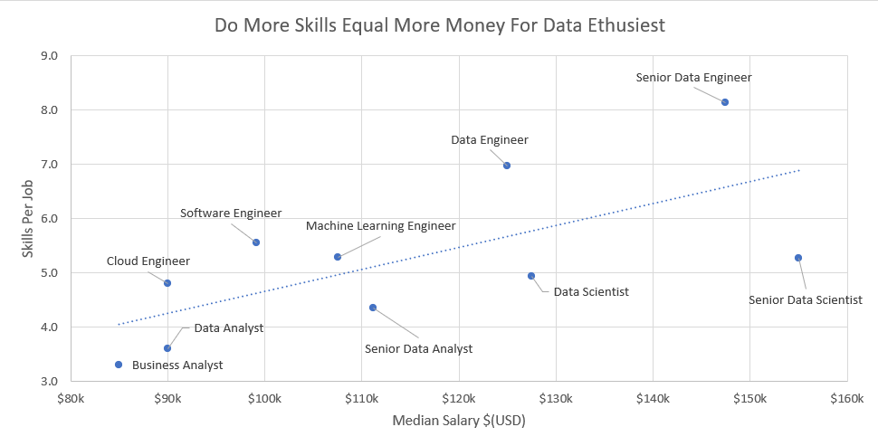

# Data Science Job Market and Salary Insights Dashboard
---

## Introduction

This Excel-based dashboard project explores the Data Science job market and salary trends in a simple and interactive way. It analyzes real-world data to highlight key insights such as popular job roles, average salaries, and industry demand.  

The dashboard is designed to help job seekers understand which skills and roles are in demand, and to assist professionals in making informed career decisions. Recruiters can also use it to quickly visualize market trends and benchmark salaries.

## Excel Skills Used

The following Excel skills were utilized for analysis:

- Power Query
- Pivot Tables
- DAX
- Data Modeling

## Data Jobs Set
The dataset used for this project contains real-world data science job information from 2023.which provides a foundation for analyzing data using Excel. It includes detailed information.

## Insights Gained
- This enables quick identification of salary trends, noting that Senior roles and Engineers are higher-paying than Analyst roles.
- Enables quick grasp of global salary disparities and highlights high/low salary regions.
- It also has some KPI'S that show Median Salary, Job Count, Top Job Platform for the role

## Conclusion
I created this dashboard to showcase insights into salary trends across various data-related job titles.This dashboard allows users to make informed decisions about their career paths. Exploring the      functionalities to understand how location and job type influence salaries.

---
## Part-2 (Salary Analysis)

In the data science market. I set out to understand what skills top employers request and how to land more pay by exploring this dataset.

### Question for analysis

I asked the following questions to understand what top skills required in the org.

1. Do more skills get you better pay?
2. What’s the salary for data jobs in different regions?
3. What are the top skills of data professionals?
4. What’s the pay for the top 10 skills?

## 1.Do more skills get you better pay?

