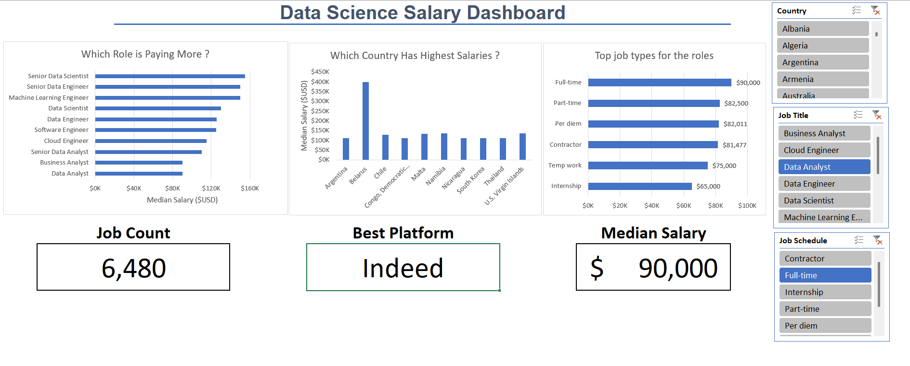

# Data Science Job Market and Salary Insights Dashboard
---

## Introduction

This Excel-based dashboard project explores the Data Science job market and salary trends in a simple and interactive way. It analyzes real-world data to highlight key insights such as popular job roles, average salaries, and industry demand.  

The dashboard is designed to help job seekers understand which skills and roles are in demand, and to assist professionals in making informed career decisions. Recruiters can also use it to quickly visualize market trends and benchmark salaries.
